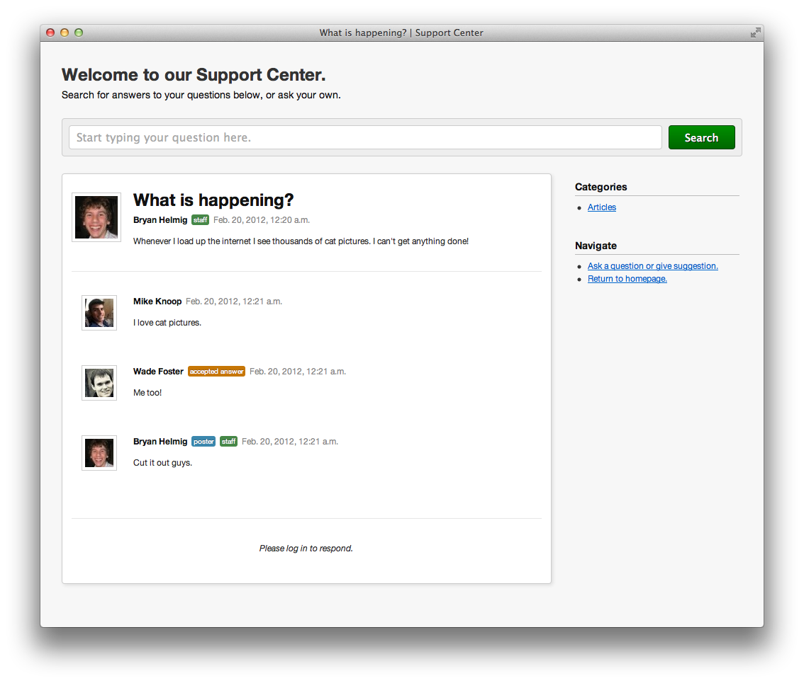
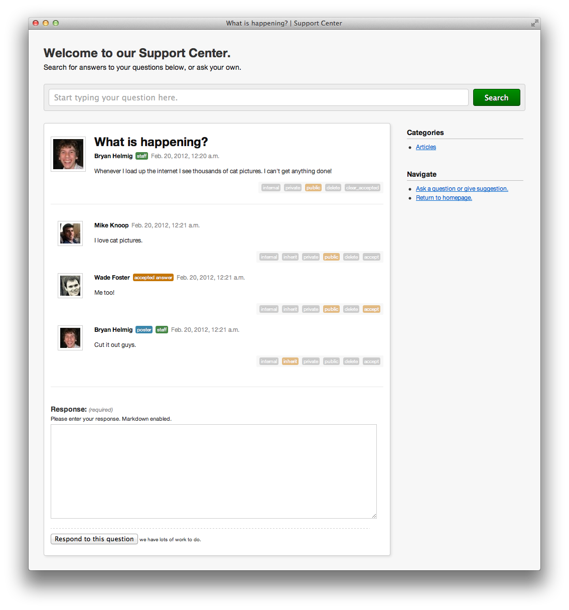
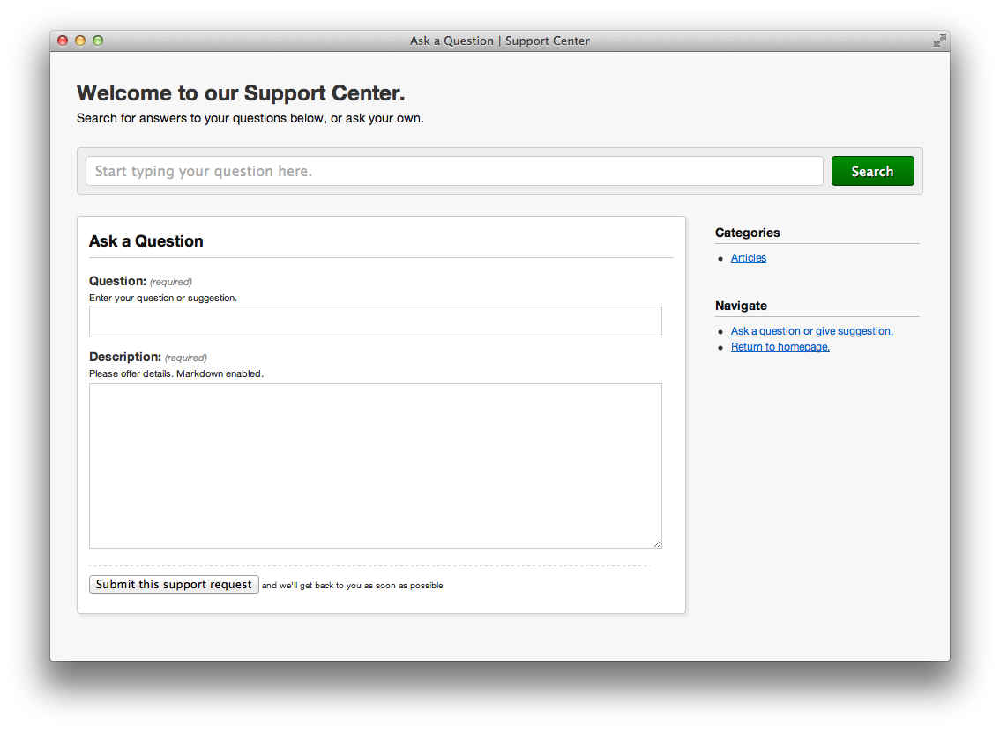
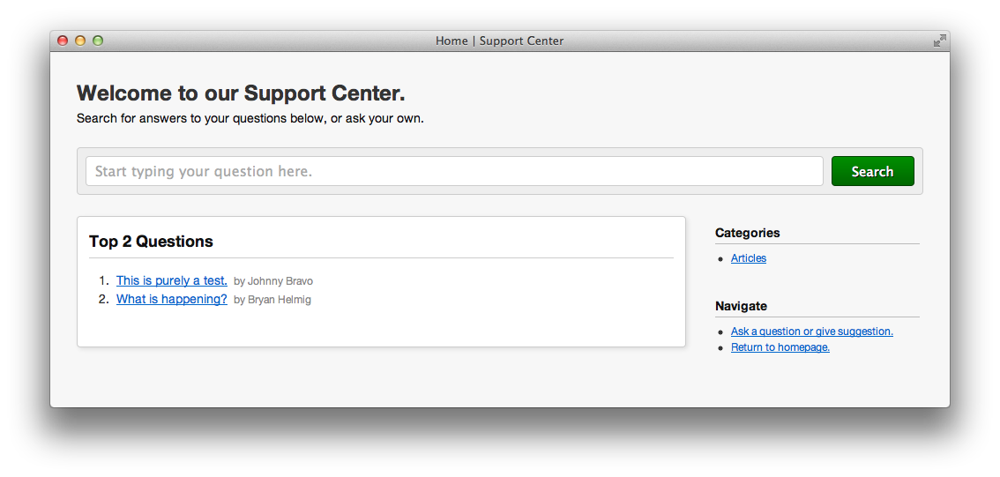
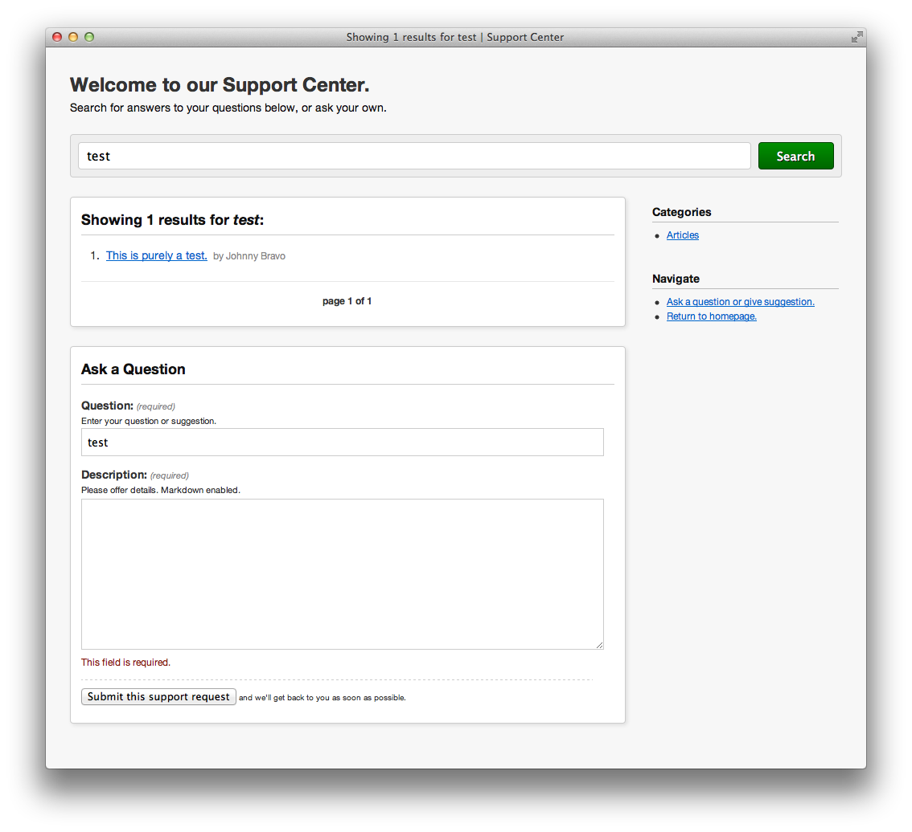
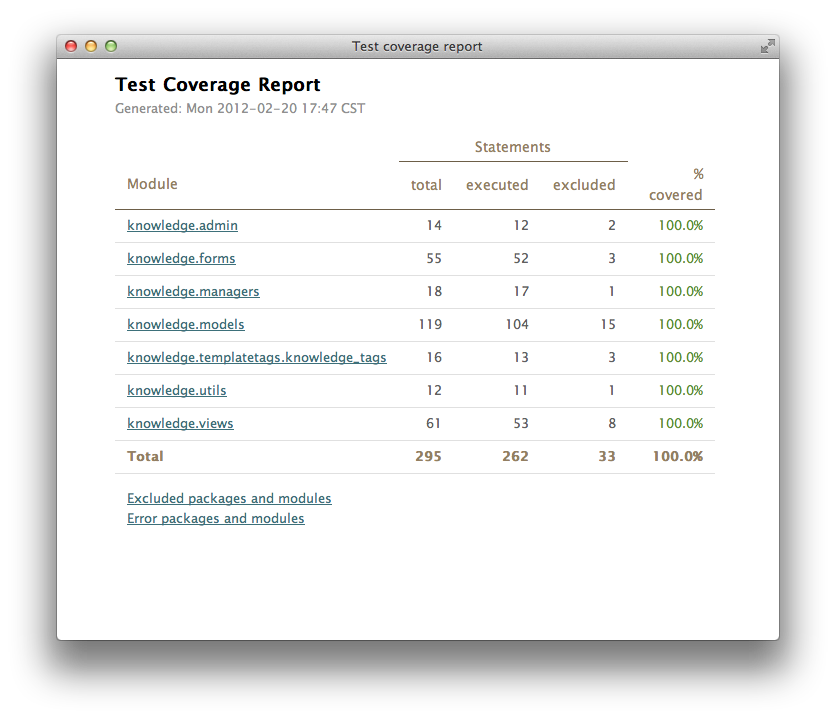

.. Django Knowledge documentation master file, created by
   sphinx-quickstart on Thu Feb 16 12:54:45 2012.
   You can adapt this file completely to your liking, but it should at least
   contain the root `toctree` directive.

Welcome to Django Knowledge's documentation!
=======================================

Django Knowledge makes it easy to add an integrated support desk, help desk or 
knowledge base to your Django project with only a few lines of boilerplate code. 
It comes with a searchable knowledge base, admin interface tie-in, and question 
form.

While we give you a generic design for free, you should just as easily be able 
to customize the look and feel of the app if you like.

At a glance:
------------

- Turn common questions or support requests into a **knowledge base**.
- Control who sees what with simple view statuses: *public*, *private*, or *internal*.
- Assign questions and answers to **categories** for easy sorting.
- Staff get **moderation controls** or they can use the familiar *Django admin* to handle support requests.
- Included base **templates and design** with prebundled HTML and CSS.

Contents:
--------------

.. toctree::
   :maxdepth: 2

   overview
   install
   configuring
   development
   customize
   performance
   settings

Screen Shots:
-------------

